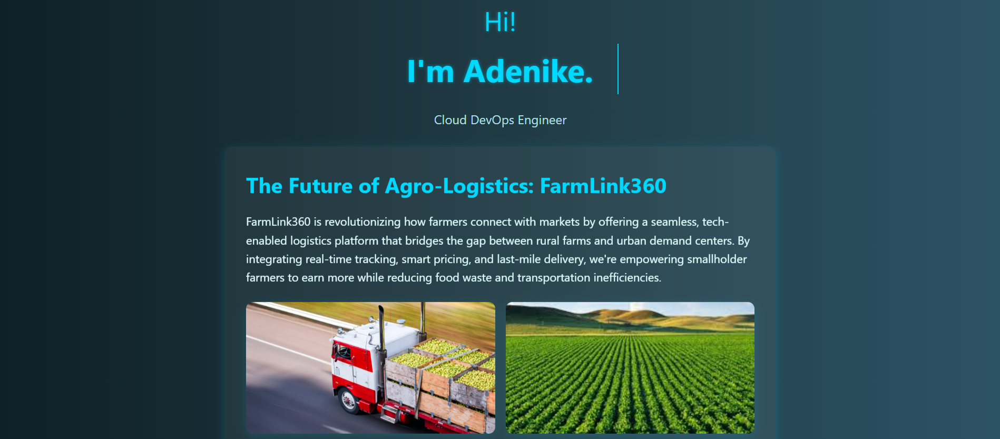

# FarmLinks360 - Cloud Engineering Project



---

## 📌 Project Overview

**FarmLinks360** is a dynamic landing page developed as part of my AltSchool Cloud Engineering second semester exam. It showcases a tech-driven agro-logistics solution and includes information about me, my projects, and contact information.

This README outlines how I planned, developed, and deployed the project from start to finish.

---

### 1. 🧠 Project Idea & Planning

* **FarmLinks360** is a startup that addresses agro-logistics challenges in Nigeria.
* I outlined the basic sections of the landing page: Intro, Project Pitch, Bio, Portfolio, and Contact.

### 2. 💻 Initial Setup on EC2

* I launched an EC2 instance on AWS using Ubuntu.
* I connected to it via SSH using my `.pem` key file:

  ```bash
  ssh -i "my-key.pem" ubuntu@<EC2-PUBLIC-IP>
  ```
* I created and switched to a dedicated linux user "devuser" for the project


### 3. ⚙️ Installing Dependencies

* Updated the server:

  ```bash
  sudo apt update && sudo apt upgrade
  ```
* Installed Node.js and npm:

  ```bash
  sudo apt install nodejs npm
  ```
* Verified installation:

  ```bash
  node -v
  npm -v
  ```

### 4. 📁 Project Folder Structure

On the EC2 instance, I created the project folder and set up the following structure:

## 📁 Project Structure

```
project-altschool_1/
├── app.js                 # Node.js server entry point
├── setup.sh               # Shell setup script
├── package.json           # Node.js dependencies and scripts
├── static/
│   ├── style.css          # CSS styles
│   ├── index.html         # Main HTML file
│   └── images/            # image files
└── README.md              # Project documentation
```

I used `express.static()` in Node.js to serve the static files.

### 5. ✏️ Writing HTML & CSS

* I wrote a semantic HTML file containing sections for intro, project, bio, and contact.
* I styled it using CSS with responsive layout and clean typography.
* I included an image gallery showing Agro-logistics concepts.

### 6. 🖼️ Adding Images

* I created a `static/images/` folder.
* On my local machine, I placed `.jpg` and `.png` images inside a folder.
* I used `scp` to transfer them:

  ```bash
  scp -i my-key.pem -r project-images ubuntu@<EC2-PUBLIC-IP>:~/project-altschool_1/static/images/
  ```

### 7. 🌐 Setting Up Nginx

* Installed Nginx:

  ```bash
  sudo apt install nginx
  ```
* Configured a reverse proxy:

  ```nginx
  server {
    listen 80;
    server_name <EC2-PUBLIC-IP>;

    location / {
      proxy_pass http://localhost:3000;
      proxy_http_version 1.1;
      proxy_set_header Upgrade $http_upgrade;
      proxy_set_header Connection 'upgrade';
      proxy_set_header Host $host;
      proxy_cache_bypass $http_upgrade;
    }

    location /static/ {
      alias /home/ubuntu/project-altschool_1/static/;
    }
  }
  ```
* Tested and reloaded Nginx:

  ```bash
  sudo nginx -t && sudo systemctl reload nginx
  ```

### 8. 🔐 Security Enhancements

* Enabled UFW:

  ```bash
  sudo ufw allow 'OpenSSH'
  sudo ufw allow 'Nginx Full'
  sudo ufw enable
  ```
* Disabled Nginx version exposure:

  * Edited `/etc/nginx/nginx.conf`
  * Uncommented:

    ```nginx
    server_tokens off;
    ```

### 9. 🚀 Deployment & Testing

* Started Node.js app using PM2 to ensure it runs in the background even after terminal logout or crash:

  ```bash
  npm install -g pm2
  pm2 start app.js
  pm2 save
  pm2 startup
  ```

* This ensures the Node.js app stays running and restarts on server reboot.
* Verified deployment by visiting:

  ```
  http://<EC2-PUBLIC-IP>
  ```

### 10. 🔄 Version Control with Git & GitHub

* Initialized git, created `.gitignore`, and committed only relevant files:

  ```bash
  echo 'node_modules/' >> .gitignore
  git init
  git checkout -b feature-branch
  git add .
  git commit -m "initial commit"
  git remote add origin https://github.com/AdetokunAdenike/project-altschool_1.git
  git push --set-upstream origin feature-branch
  ```
* Created and merged a Pull Request into `main`.

---

## 🌍 Live Demo

**Public IP:** [http://54.154.83.25/](http://54.154.83.25/)

---

## 📜 Tech Stack

* HTML5, CSS3
* Node.js (Express)
* Nginx (as reverse proxy)
* PM2 (Node process manager)
* AWS EC2 (Ubuntu)

---

## 🤝 Author

**Adetokun Adenike**  
Email: adetokunadenike@gmail.com  
GitHub: [AdetokunAdenike](https://github.com/AdetokunAdenike)

---

## 📜 License

This project is licensed under the MIT License.

> ✅ This project is part of my AltSchool Cloud Engineering Second Semester Exam (2025)